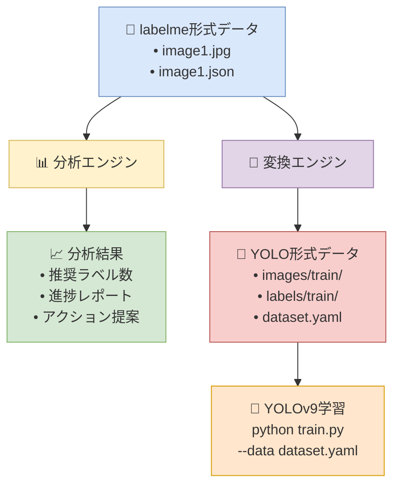
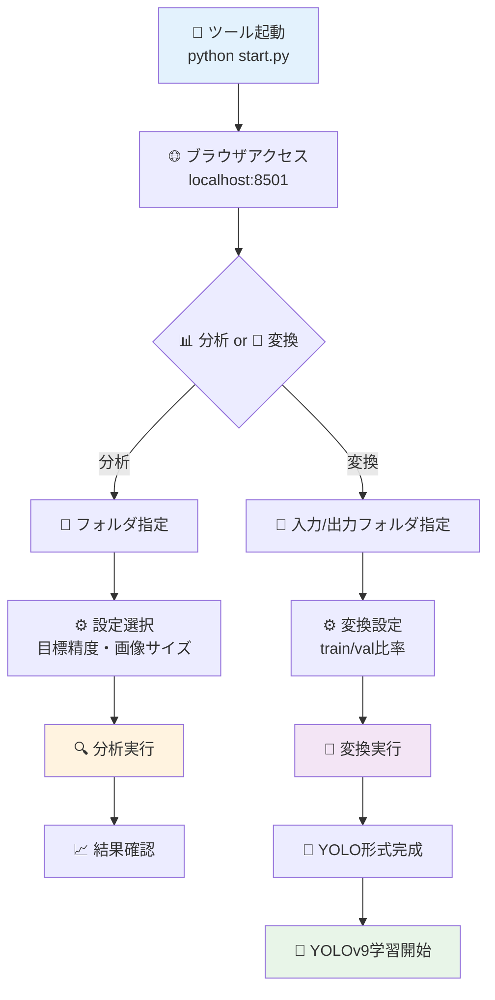
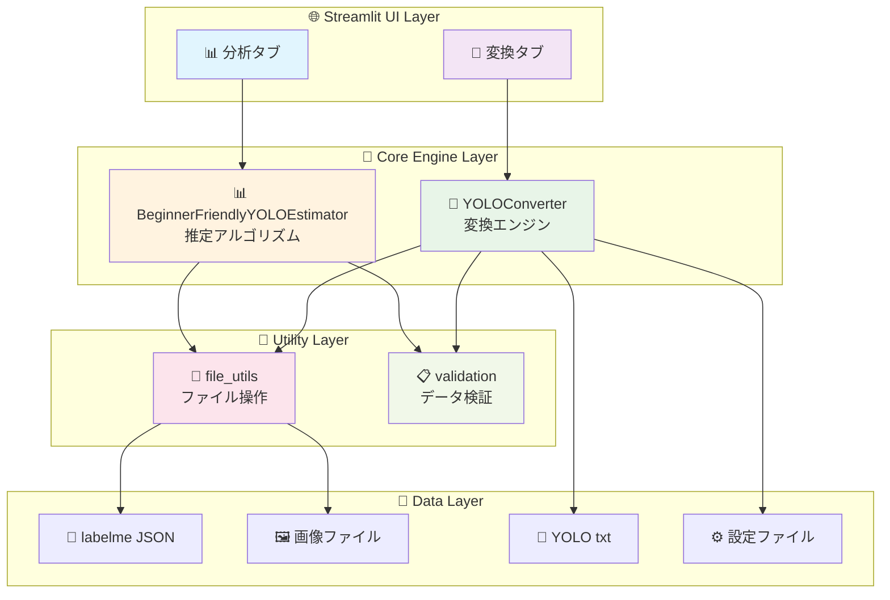

# 🎯 YOLO データセット分析ツール

YOLOv9向けの初心者フレンドリーなデータセット分析ツールです。
labelmeでアノテーションしたデータセットを分析し、学習に必要なラベル数を推定します。

## 🔄 全体ワークフロー



## ✨ 特徴

- 🔍 **簡単分析**: フォルダを指定するだけで自動分析
- 📊 **視覚化**: 分かりやすいグラフとチャート
- 🎯 **推定機能**: 目標精度に必要なラベル数を推定
- 📋 **アクション提案**: 次にやるべきことを具体的に提示
- 🔄 **YOLO変換**: labelme → YOLO形式の自動変換
- ✅ **データセット検証**: 変換結果の妥当性チェック
- 🌐 **Webインターフェース**: ブラウザで操作、直感的UI

## 📦 インストール

### 方法1: Python環境がある場合

```bash
# リポジトリをクローン
git clone <repository-url>
cd yolo_dataset_analyzer

# 依存関係をインストール
pip install -r requirements.txt

# ツールを起動
python start.py
```

### 方法2: 初心者向け（予定）

ZIPファイルをダウンロードして「起動.bat」をダブルクリック

## 🚀 使い方

### 基本的な流れ



### 詳細手順

1. **ツールを起動**
   ```bash
   python start.py
   ```

2. **ブラウザでアクセス**
   - 自動でブラウザが開きます
   - または http://localhost:8501 にアクセス

3. **分析タブ**: データセット分析
   - 📁 画像とlabelme JSONファイルが入ったフォルダを指定
   - ⚙️ 目標精度（60%, 70%, 80%）・画像サイズを選択
   - 🔍 「分析開始」ボタンをクリック

4. **変換タブ**: YOLO形式に変換
   - 📁 入力フォルダ（labelme形式）を指定
   - 📂 出力フォルダ（YOLO形式）を指定
   - ⚙️ train/val分割比率を設定
   - 🔄 「YOLO形式に変換」ボタンをクリック

## 📁 データセット準備

フォルダ構成例：
```
your_dataset/
├── image1.jpg      # 画像ファイル
├── image1.json     # labelme JSONファイル
├── image2.jpg
├── image2.json
└── ...
```

### 対応ファイル形式

- **画像**: .jpg, .jpeg, .png, .bmp, .tiff, .webp
- **アノテーション**: .json (labelme形式、矩形のみ)

## 🔧 システム要件

- Python 3.8以上
- 以下のライブラリ:
  - streamlit >= 1.28.0
  - pandas >= 2.0.0
  - plotly >= 5.15.0
  - pillow >= 10.0.0
  - numpy >= 1.24.0
  - pyyaml >= 6.0

## 🏗️ システム構造



## 📊 機能詳細

### 分析機能
- ラベル数の統計
- クラス分布の可視化
- 画像とJSONファイルのペア確認
- データセット品質チェック

### 推定機能
- 目標精度に基づく必要ラベル数計算
- 軽量モデル対応の現実的な推定値
- 画像サイズ別の補正
- クラス複雑度の自動判定

### 🔄 YOLO変換機能
- labelme JSON → YOLO txt形式変換
- 自動train/val分割（カスタマイズ可能）
- dataset.yaml, classes.names自動生成
- 座標系の正確な変換
- 変換結果の検証機能

### UI機能
- タブ式インターフェース（分析 / 変換）
- リアルタイム進捗表示
- 分かりやすいメトリクス表示
- インタラクティブなグラフ
- CSV形式でのレポート出力

## 🎯 推定アルゴリズム

経験則に基づく推定式を使用：

```
必要ラベル数 = ベース数 × 精度補正 × サイズ補正
```

- **ベース数**: オブジェクトの複雑度による
  - 簡単（車、人など）: 70-200枚
  - 中程度（家具など）: 150-400枚  
  - 複雑（小物など）: 300-800枚

- **精度補正**: 目標精度による倍率
- **サイズ補正**: 画像サイズによる補正

## 🤝 貢献

プルリクエストやイシューの報告を歓迎します！

## 📄 ライセンス

MIT License

## 🆘 サポート

質問や問題がある場合は、Issueを作成してください。

## 📊 詳細図解

より詳しいシステム図解は [docs/diagrams.md](docs/diagrams.md) をご覧ください。

- 🔄 データ変換フロー
- 🎯 推定アルゴリズム詳細
- 📁 プロジェクト構造
- 🔄 座標変換の仕組み

---

**初心者の方へ**: 分からないことがあれば、お気軽にお聞きください！