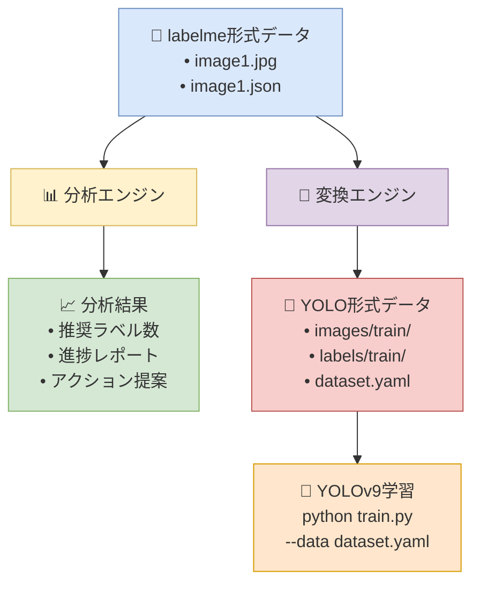
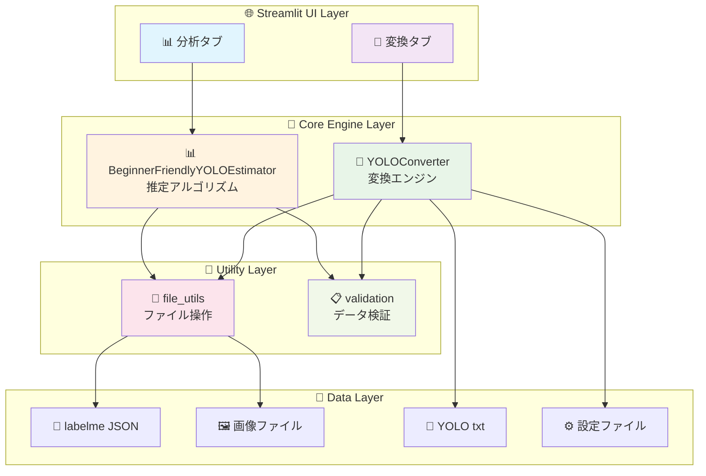
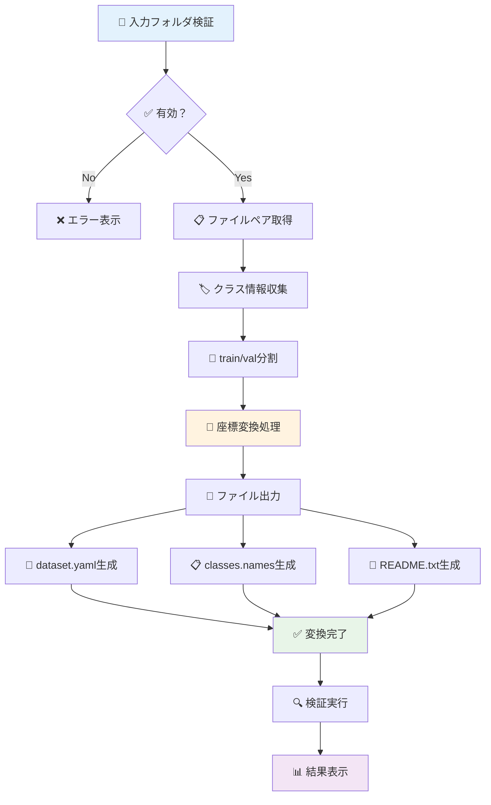
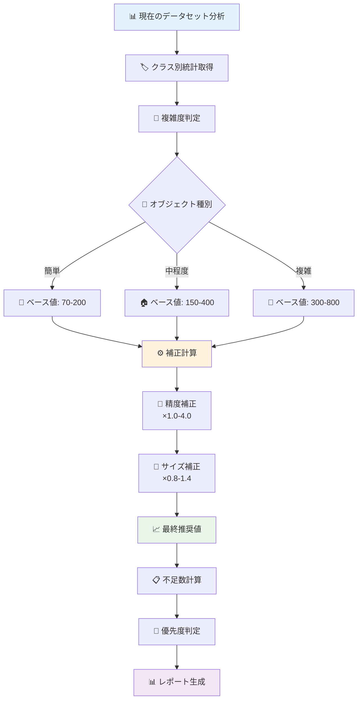

# 📊 システム図解

このファイルには、YOLO Dataset Analyzerの各種図解を掲載しています。

## 🔄 全体ワークフロー



## 🏗️ システムアーキテクチャ



## 📊 データ変換フロー



## 🎯 推定アルゴリズムフロー



## 📁 フォルダ構造

```
yolo_dataset_analyzer/
├── 📄 README.md              # プロジェクト説明
├── 📄 requirements.txt       # 依存関係
├── 📄 pyproject.toml         # プロジェクト設定
├── 🚀 start.py              # 起動スクリプト
├── 📁 src/                   # ソースコード
│   ├── 🧮 analyzer/          # 分析エンジン
│   │   ├── estimator.py      # 推定アルゴリズム
│   │   └── __init__.py
│   ├── 🔄 converter/         # 変換エンジン
│   │   ├── yolo_converter.py # YOLO変換
│   │   └── __init__.py
│   ├── 🖥️ ui/               # ユーザーインターフェース
│   │   ├── streamlit_app.py  # メインUI
│   │   └── __init__.py
│   ├── 🔧 utils/            # ユーティリティ
│   │   ├── file_utils.py     # ファイル操作
│   │   └── __init__.py
│   └── __init__.py
├── 📁 docs/                  # ドキュメント
│   └── diagrams.md           # このファイル
├── 📁 tests/                 # テスト（将来用）
├── 📁 examples/              # サンプルデータ（将来用）
└── 📁 dist/                  # 配布パッケージ（将来用）
```

## 🔄 データ形式変換

### labelme形式 → YOLO形式

```mermaid
graph LR
    subgraph "📥 入力 (labelme)"
        A1[image1.jpg]
        A2[image1.json<br/>{<br/>&nbsp;&nbsp;shapes: [<br/>&nbsp;&nbsp;&nbsp;&nbsp;{<br/>&nbsp;&nbsp;&nbsp;&nbsp;&nbsp;&nbsp;label: 'car',<br/>&nbsp;&nbsp;&nbsp;&nbsp;&nbsp;&nbsp;points: [[x1,y1],[x2,y2]]<br/>&nbsp;&nbsp;&nbsp;&nbsp;}<br/>&nbsp;&nbsp;]<br/>}]
    end
    
    subgraph "🔄 変換処理"
        B1[座標変換<br/>矩形 → 中心点+幅高さ]
        B2[正規化<br/>0-1範囲に変換]
        B3[クラスID<br/>文字列 → 数値]
    end
    
    subgraph "📤 出力 (YOLO)"
        C1[image1.jpg]
        C2[image1.txt<br/>0 0.5 0.3 0.2 0.1]
        C3[dataset.yaml<br/>classes: ['car']<br/>train: images/train<br/>val: images/val]
    end
    
    A1 --> B1
    A2 --> B1
    B1 --> B2
    B2 --> B3
    B3 --> C1
    B3 --> C2
    B3 --> C3
    
    style A2 fill:#dae8fc
    style B1 fill:#fff2cc
    style B2 fill:#fff2cc
    style B3 fill:#fff2cc
    style C2 fill:#f8cecc
    style C3 fill:#f8cecc
```

---

## 📋 使い方（図解付き）

### Step 1: 分析タブでデータセット確認
```
📊 分析タブ → フォルダ指定 → 分析実行 → 📈 結果確認
```

### Step 2: 変換タブでYOLO形式に変換
```
🔄 変換タブ → 入力/出力指定 → 変換実行 → 🎯 YOLO形式出力
```

### Step 3: YOLOv9で学習
```
🚀 生成されたdataset.yamlを使用してYOLOv9学習開始
```